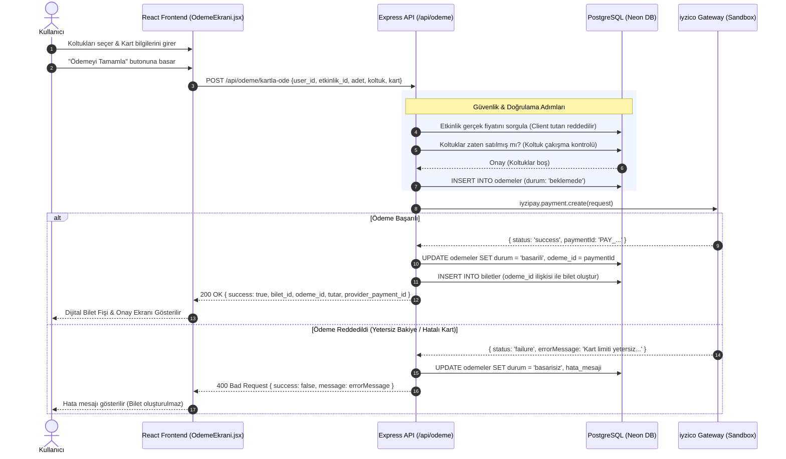

# 💳 Meyuco — iyzico Ödeme Sistemi Dokümantasyonu

Bu belge, Meyuco Etkinlik & Bilet Satış Platformu için geliştirilen **iyzico ödeme entegrasyonunun** mimarisini, veri modellerini, güvenlik katmanlarını, API uç noktalarını ve test senaryolarını detaylı olarak açıklamaktadır.

---

## 📑 İçindekiler
1. [Sistem Mimarisi ve Akış](#-sistem-mimarisi-ve-akış)
2. [Güvenlik ve Bütünlük Mekanizmaları](#-güvenlik-ve-bütünlük-mekanizmaları)
3. [Veritabanı Şeması](#-veritabanı-şeması)
4. [API Uç Noktaları (Endpoints)](#-api-uç-noktaları-endpoints)
5. [Ortam Değişkenleri ve Kurulum](#-ortam-değişkenleri-ve-kurulum)
6. [Sandbox Test Kartları ve Hızlı Doldurma](#-sandbox-test-kartları-ve-hızlı-doldurma)
7. [Frontend Arayüzü ve Kullanıcı Deneyimi](#-frontend-arayüzü-ve-kullanıcı-deneyimi)

---

## 🏗️ Sistem Mimarisi ve Akış

Meyuco ödeme altyapısı, istemci (React) tarafında kullanıcının kart girdiği şık 3D görselleştirme ile sunucu (Node.js/Express) tarafında çalışan banka doğrulamasını birbirine bağlar.

### Uçtan Uca Ödeme Akış Şeması



---

## 🛡️ Güvenlik ve Bütünlük Mekanizmaları

### 1. Sunucu Taraflı Fiyat Doğrulama (Anti-Tampering)
İstemci tarafında tarayıcı araçlarıyla tutar değiştirilse bile, sunucu gelen fiyat parametresine **kesinlikle güvenmez**.
- Etkinliğin tablodaki güncel birim fiyatı (`etkinlikler.fiyat`) doğrudan veritabanından çekilir.
- Toplam Tutar = `fiyat * adet` formülü sunucu üzerinde hesaplanır.

### 2. Mükerrer Satış & Koltuk Çakışması Koruması (Race Condition Prevention)
İki farklı kullanıcı aynı koltuğu aynı saniyelerde satın almaya çalıştığında:
- Ödeme sağlayıcısına gitmeden önce o etkinlikteki dolu koltuklar sorgulanır.
- Eğer talep edilen koltuklardan herhangi biri daha önce satılmışsa işlem **409 Conflict** koduyla reddedilir ve karttan para çekilmez.

### 3. İki Aşamalı İşlem Kaydı (Two-Phase Recording)
- Ödeme başlatılmadan önce `odemeler` tablosunda `beklemede` kaydı oluşturulur.
- Yalnızca iyzico işleminden `status: "success"` döndüğünde bilet kesilir (`biletler` tablosuna yazılır) ve ödeme durumu `basarili` yapılır.
- Para çekilip bilet kesilmeme veya bilet kesilip para çekilmeme ihtimali ortadan kaldırılmıştır.

---

## 🗄️ Veritabanı Şeması

### `odemeler` Tablosu
Tüm ödeme işlemlerini, durumlarını ve sağlayıcı referans kodlarını saklar:

```sql
CREATE TABLE IF NOT EXISTS odemeler (
  id SERIAL PRIMARY KEY,
  user_id INT NOT NULL REFERENCES users(id) ON DELETE CASCADE,
  etkinlik_id INT NOT NULL REFERENCES etkinlikler(id) ON DELETE CASCADE,
  tutar DECIMAL(10, 2) NOT NULL,
  adet INT NOT NULL DEFAULT 1,
  koltuk VARCHAR(255) DEFAULT NULL,
  odeme_saglayici VARCHAR(50) DEFAULT 'iyzico',
  odeme_id VARCHAR(255) DEFAULT NULL,            -- iyzico paymentId
  durum VARCHAR(50) DEFAULT 'beklemede',          -- beklemede | basarili | basarisiz
  hata_mesaji TEXT DEFAULT NULL,                 -- Varsa banka hata detayı
  created_at TIMESTAMP DEFAULT CURRENT_TIMESTAMP
);
```

### `biletler` Tablosundaki İlişki
```sql
ALTER TABLE biletler ADD COLUMN IF NOT EXISTS odeme_id INT REFERENCES odemeler(id) ON DELETE SET NULL;
```

---

## 🔌 API Uç Noktaları (Endpoints)

### 1. Kartla Ödeme Yapma
- **Yol:** `POST /api/odeme/kartla-ode`
- **Açıklama:** Kart bilgilerini alır, iyzico üzerinden tahsilatı gerçekleştirir ve başarılıysa bileti oluşturur.

#### İstek (Request Body):
```json
{
  "user_id": 1,
  "etkinlik_id": 2,
  "adet": 2,
  "koltuk": ["B1", "B2"],
  "kart": {
    "isim": "AHMET YILMAZ",
    "kartNo": "5890040000000016",
    "sonKullanma": "12/28",
    "cvc": "123"
  }
}
```

#### Başarılı Yanıt (200 OK):
```json
{
  "success": true,
  "message": "Ödemeniz başarıyla tamamlandı ve biletiniz oluşturuldu!",
  "bilet_id": 15,
  "odeme_id": 8,
  "provider_payment_id": "PAY_1789327869452",
  "tutar": 2400,
  "satin_alma_tarihi": "2026-09-13T19:42:00.000Z",
  "is_mock": false
}
```

#### Başarısız Yanıt (400 Bad Request):
```json
{
  "success": false,
  "message": "Kart limiti yetersiz veya işlem banka tarafından reddedildi.",
  "errorCode": "51"
}
```

#### Koltuk Çakışması Yanıtı (409 Conflict):
```json
{
  "success": false,
  "message": "Seçtiğiniz koltuk(lar) (B1) az önce başka bir kullanıcı tarafından satın alındı. Lütfen başka bir koltuk seçiniz."
}
```

---

### 2. Kullanıcı Ödeme Geçmişi
- **Yol:** `GET /api/odeme/gecmis/:user_id`
- **Açıklama:** Belirtilen kullanıcının tüm ödeme hareketlerini, etkinlik adı, tarihi ve durumuyla birlikte listeler.

---

### 3. Ödeme Servis Durumu
- **Yol:** `GET /api/odeme/durum`
- **Açıklama:** iyzico istemcisinin canlı Sandbox modunda mı yoksa geliştirme simülasyonunda mı çalıştığını döner.

---

## ⚙️ Ortam Değişkenleri ve Kurulum

Sunucu ortamında `.env` dosyasına aşağıdaki değişkenler tanımlanabilir:

```env
# Meyuco Backend .env

PORT=5001
DB_URL=postgresql://...

# iyzico Yapılandırması
IYZICO_API_KEY=sandbox-xxxxxxxxxxxxxxxxxxxxx
IYZICO_SECRET_KEY=sandbox-xxxxxxxxxxxxxxxxxxxxx
IYZICO_BASE_URL=https://sandbox-api.iyzipay.com
```

> [!NOTE]
> **Otomatik Simülasyon Desteği:**
> Eğer `IYZICO_API_KEY` ortam değişkeni girilmemişse veya `sandbox-api-key` olarak bırakılmışsa, backend otomatik olarak **Akıllı Simülasyon Moduna** geçer. Bu sayede hiçbir test anahtarına ihtiyaç duymadan da tüm uçtan uca akışı test edebilirsiniz.

---

## 🧪 Sandbox Test Kartları ve Hızlı Doldurma

Frontend üzerinde ödeme ekranında geliştiriciler ve test kullanıcıları için iki adet hızlı test butonu sunulmuştur:

| Buton | Kart Numarası | SKT | CVV | Beklenen Davranış |
| :--- | :--- | :--- | :--- | :--- |
| **✓ Başarılı Test Kartı** | `5890 0400 0000 0016` | `12/28` | `123` | Ödeme anında onaylanır, bilet ve fiş üretilir. |
| **✕ Hatalı Kart** | `4354 0855 5555 5557` | `12/28` | `123` | Bakiye yetersiz hatası simüle edilir, bilet kesilmez. |

Dilerseniz geçerli herhangi bir iyzico test kartını da manuel yazabilirsiniz:
- `4543 6000 0000 0006` (Visa Başarılı)
- `4000 0000 0000 0000` (Geçersiz Kart Hatası)

---

## 🎨 Frontend Arayüzü ve Kullanıcı Deneyimi

1. **3D Dönen Kart Animasyonu ([`OdemeEkrani.jsx`](file:///Volumes/SandiskSSD/Kodlar/meyuco/src/Pages/OdemeEkrani.jsx)):**
   - Kullanıcı kart numarasını girdikçe ön yüz dinamik güncellenir.
   - CVV alanına odaklandığında (focus) kart 180 derece arkaya döner, CVV bandı gösterilir.
2. **Korumalı Form Kontrolleri:**
   - Kart numarası 16 haneli bloklara otomatik ayrıştırılır.
   - Son kullanma tarihi `AA/YY` formatına otomatik maskelenir.
3. **Onay Fişi Ekranı:**
   - Başarılı ödemenin ardından yeşil onay damgasıyla ödeme referansı, bilet ID'si, koltuklar ve ödenen net tutar listelenir.
4. **Profil Entegrasyonu ([`Profile.jsx`](file:///Volumes/SandiskSSD/Kodlar/meyuco/src/Pages/Profile.jsx)):**
   - Kullanıcının biletleri listelenirken ödenen tutar `💳 ... ₺` rozeti ile şeffaf şekilde gösterilir.

