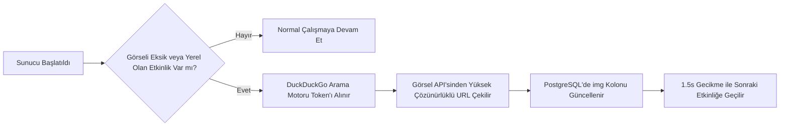
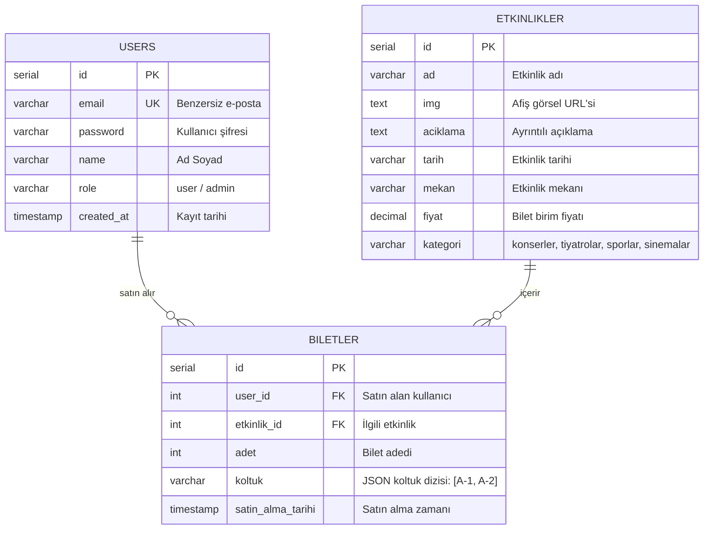

<div align="center">

  # ⚙️ Meyuco Backend — RESTful API & Veritabanı Servisi

  **Meyuco Etkinlik ve Bilet Satış Platformu için Node.js, Express 5 ve PostgreSQL tabanlı güçlü, modüler ve akıllı backend altyapısı.**

  <p align="center">
    <a href="https://meyuco.vercel.app/" target="_blank">
      
    </a>
    <a href="https://github.com/ismailcolakk13/meyuco" target="_blank">
      
    </a>
  </p>

  <p align="center">
    
    
    
    
    
  </p>

  <p align="center">
    <a href="#-proje-bağlantıları">Proje Bağlantıları</a> •
    <a href="#-mimari-ve-öne-çıkan-özellikler">Özellikler</a> •
    <a href="#-otomatik-görsel-tarayıcı-scraper">Görsel Tarayıcı</a> •
    <a href="#-veritabanı-şeması">Veritabanı</a> •
    <a href="#-api-uç-noktaları-endpoints">API Referansı</a> •
    <a href="#-kurulum-ve-çalıştırma">Kurulum</a> •
    <a href="#-demo-hesaplar">Demo Hesaplar</a>
  </p>

</div>

---

## 🔗 Proje Bağlantıları

Bu backend servisi, Meyuco platformunun veri ve iş mantığı katmanını oluşturur:

| Servis | Bağlantı | Açıklama |
| :--- | :--- | :--- |
| 🌐 **Canlı Demo** | [meyuco.vercel.app](https://meyuco.vercel.app/) | Vercel üzerinde barındırılan güncel canlı web uygulaması |
| 🎨 **Frontend Deposu** | [ismailcolakk13/meyuco](https://github.com/ismailcolakk13/meyuco) | React 19 & Vite tabanlı istemci deposu |
| 🖥️ **Backend Deposu** | [ismailcolakk13/meyuco-backend](https://github.com/ismailcolakk13/meyuco-backend) | Express.js & PostgreSQL REST API servisi |

---

## 🏗️ Mimari ve Öne Çıkan Özellikler

- **Modüler Rota Mimarisi:** Kimlik doğrulama (`auth`), etkinlik yönetimi (`etkinlikler`) ve bilet/koltuk işlemleri (`biletler`) mantıksal katmanlara ayrılmıştır.
- **İlişkisel Veri Modeli:** PostgreSQL ile kullanıcılar, etkinlikler ve biletler arasında güçlü yabancı anahtar (`FOREIGN KEY`) ilişkileri ve silme kaskadları (`ON DELETE CASCADE`).
- **Koltuk Çakışma Yönetimi:** Satın alınan koltukları JSON dizisi olarak saklayarak etkinlik bazında dolu koltukları sorgulama ve mükerrer satışı engelleme.
- **Akıllı Otomatik Görsel Tarayıcı:** Sunucu başlatıldığında afişi eksik olan etkinlikleri tespit eder ve internet üzerinden yüksek çözünürlüklü görsellerle veritabanını günceller.
- **Docker Compose Desteği:** PostgreSQL 16 veritabanını tek komutla, otomatik şema ve tohum veriler (`init.sql`) ile ayağa kaldırabilme.
- **CORS & JSON Body Parser Desteği:** Modern istemci uygulamalarıyla sorunsuz iletişim.

---

## 🤖 Otomatik Görsel Tarayıcı (Scraper)

Backend, `scrapers/imageScraper.js` modülü ile akıllı bir görsel tamamlama mekanizmasına sahiptir:



Bu sayede yeni bir etkinlik eklendiğinde görsel linki belirtilmese dahi sistem otomatik olarak etkinliğin adını ve kategorisini tarayarak gerçek afiş görselini bulup veritabanına kaydeder.

---

## 🛠️ Teknoloji Yığını

| Teknoloji | Sürüm | Kullanım Alanı |
| :--- | :--- | :--- |
| **Node.js** | `>=18.0.0` | Sunucu çalışma ortamı (JavaScript Runtime) |
| **Express** | `^5.1.0` | Yüksek performanslı ve modüler RESTful API çerçevesi |
| **PostgreSQL** | `16-alpine` | Güçlü ilişkisel veritabanı yönetim sistemi (RDBMS) |
| **pg (node-postgres)** | `^8.13.3` | PostgreSQL bağlantı havuzu (connection pool) ve istemcisi |
| **Docker & Compose** | - | Konteynerize veritabanı altyapısı ve hacim (volume) yönetimi |
| **Bcrypt & JWT** | `^6.0.0` / `^9.0.2` | Şifreleme ve yetkilendirme kütüphaneleri |
| **Dotenv** | `^16.5.0` | Ortam değişkenleri yönetimi (`.env`) |

---

## 🗄️ Veritabanı Şeması



---

## 📡 API Uç Noktaları (Endpoints)

### 🔐 Kimlik Doğrulama (`/api`)

| Metot | Uç Nokta | Açıklama | İstek Gövdesi (Body) |
| :--- | :--- | :--- | :--- |
| `POST` | `/api/register` | Yeni kullanıcı kaydı oluşturur | `{ email, password, name, role? }` |
| `POST` | `/api/giris` | Kullanıcı girişi ve rol denetimi | `{ email, password }` |
| `PUT` | `/api/sifremi-unuttum` | Kullanıcı şifresini günceller | `{ email, yeni_sifre }` |

### 🎟️ Etkinlik Yönetimi (`/api`)

| Metot | Uç Nokta | Açıklama | İstek Gövdesi (Body) |
| :--- | :--- | :--- | :--- |
| `GET` | `/api/etkinlikler` | Tüm etkinlikleri listeler | - |
| `POST` | `/api/etkinlik-ekle` | Yeni etkinlik ekler *(Admin)* | `{ ad, img, aciklama, tarih, mekan, fiyat, kategori }` |
| `PUT` | `/api/etkinlik-duzenle/:id` | Etkinlik bilgilerini günceller *(Admin)* | `{ ad, img, aciklama, tarih, mekan, fiyat, kategori }` |
| `DELETE` | `/api/etkinlik-sil/:id` | Etkinliği ve ilişkili biletleri siler | - |

### 🎫 Bilet & Koltuk İşlemleri (`/api`)

| Metot | Uç Nokta | Açıklama | İstek Gövdesi / Parametre |
| :--- | :--- | :--- | :--- |
| `POST` | `/api/bilet-al` | Koltuk seçimiyle bilet satın alır | `{ user_id, etkinlik_id, adet, koltuk }` |
| `GET` | `/api/kullanici-biletleri/:user_id` | Kullanıcının aldığı biletler | URL parametresi: `user_id` |
| `GET` | `/api/etkinlik-dolu-koltuklar/:etkinlik_id` | Etkinlikte rezerve koltukları döndürür | URL parametresi: `etkinlik_id` |
| `GET` | `/api/etkinlik-biletleri/:etkinlik_id` | Bir etkinliğin tüm katılımcıları *(Admin)* | URL parametresi: `etkinlik_id` |
| `GET` | `/api/tum-biletler` | Sistemdeki tüm bilet kayıtları *(Admin)* | - |

---

## 📂 Proje Dizin Yapısı

```bash
meyuco-backend/
├── routes/
│   ├── auth.js               # Kayıt, giriş ve şifre sıfırlama rotaları
│   ├── etkinlikler.js        # Etkinlik CRUD operasyonları
│   └── biletler.js           # Biletleme ve koltuk sorgulama rotaları
├── scrapers/
│   └── imageScraper.js       # Otomatik afiş görseli tarama ve güncelleme servisi
├── db.js                     # PostgreSQL bağlantı havuzu (pg.Pool)
├── docker-compose.yml        # PostgreSQL 16 Alpine servis tanımı
├── init.sql                  # Tablo şemaları ve başlangıç tohum verileri
├── init-db.js                # Programatik veritabanı kurulum betiği
├── index.js                  # Sunucu giriş noktası ve middleware tanımları
├── .env.example              # Ortam değişkenleri şablonu
└── package.json              # Bağımlılıklar ve npm betikleri
```

---

## 💻 Kurulum ve Çalıştırma

### Gereksinimler
- [Node.js](https://nodejs.org/) (v18+)
- [Docker](https://www.docker.com/) & Docker Compose *(veya yerel PostgreSQL)*

### 1. Depoyu Klonlayın
```bash
git clone https://github.com/ismailcolakk13/meyuco-backend.git
cd meyuco-backend
```

### 2. Bağımlılıkları Yükleyin
```bash
npm install
```

### 3. Ortam Değişkenlerini Tanımlayın
`.env.example` dosyasını `.env` olarak kopyalayın:
```bash
cp .env.example .env
```

Örnek `.env` içeriği:
```env
PORT=5001
DB_HOST=localhost
DB_PORT=5432
DB_USERNAME=postgres
DB_PASSWORD=postgres
DB_NAME=meyuco_db
```
> **Not:** Docker Compose kullanıyorsanız şifre ve kullanıcı adı docker-compose ortam değişkenleriyle eşleşmelidir. Uzak bir veritabanı kullanıyorsanız `DB_URL` değişkenini tanımlayabilirsiniz.

### 4. Veritabanını Başlatın (Docker ile Önerilen)
```bash
docker compose up -d
```
Bu komut PostgreSQL konteynerini başlatır ve `init.sql` dosyasındaki tabloları ve hazır verileri otomatik olarak yükler.

*(Alternatif: Yerel PostgreSQL kullanıyorsanız `npm run db:init` betiğini çalıştırabilirsiniz.)*

### 5. Sunucuyu Başlatın
```bash
# Geliştirme modu (watch modu ile)
npm run dev

# veya Üretim modu
npm start
```
Sunucu başlatıldığında:
```
Server 5001 portunda çalışıyor.
🔄 PostgreSQL veritabanında yerel/eksik etkinlik görselleri taranıyor...
```
çıktısı görülecektir.

---

## 🔑 Demo Hesaplar

| Rol | E-posta | Şifre | Açıklama |
| :--- | :--- | :--- | :--- |
| **Admin** | `admin@meyuco.com` | `admin123` | Yönetici paneli ve tam yetki |
| **Kullanıcı** | `user@meyuco.com` | `user123` | Bilet alımı ve profil testi |

---

## 🤝 Katkıda Bulunma

1. Depoyu forklayın (`Fork`)
2. Yeni bir dal açın (`git checkout -b feature/yeni-ozellik`)
3. Değişiklikleri kaydedin (`git commit -m 'feat: Yeni özellik eklendi'`)
4. Dalınıza gönderin (`git push origin feature/yeni-ozellik`)
5. Bir **Pull Request** oluşturun

---

<div align="center">
  <sub>Meyuco Projesi • Frontend arayüzü için <a href="https://github.com/ismailcolakk13/meyuco">meyuco</a> deposunu ziyaret edebilirsiniz.</sub>
</div>
